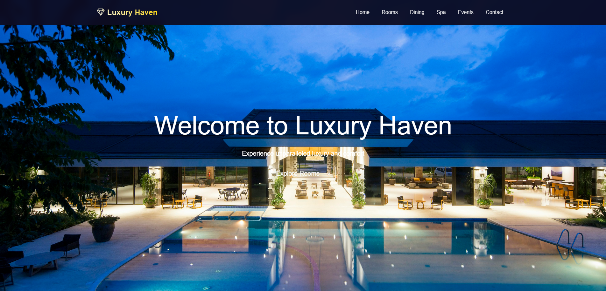

# Luxury Haven Hotel Management System Frontend

[Live Demo on Netlify](https://luxuryhavenhotel.netlify.app)

This is the frontend for the Luxury Haven Hotel Management System. It provides a user interface for hotel guests and staff to interact with the system.

## Project Structure
```
index.html           # Main HTML file
assets/
  images/            # Image assets
  videos/            # Video assets
css/
  style.css          # Main stylesheet
```

## Features
- Responsive design
- Organized asset management
- Custom styles

## Getting Started
1. Clone the repository or download the project files.
2. Open `index.html` in your web browser to view the site.

## Customization
- Add images and videos to the `assets/images` and `assets/videos` folders.
- Modify styles in `css/style.css`.

## Screenshots
Below are some screenshots of the Luxury Haven Hotel Management System frontend:




## License
This project is for educational purposes.

## Author
- GDSE-70 Internet Technology Assignment 06
